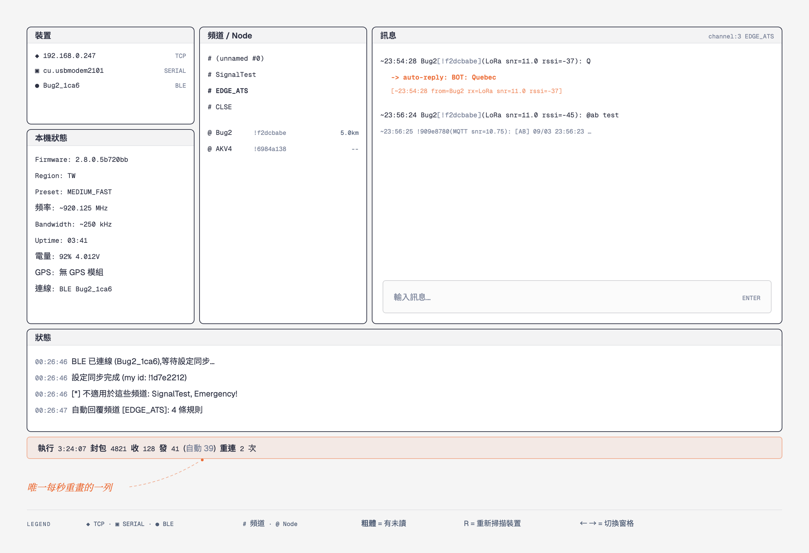
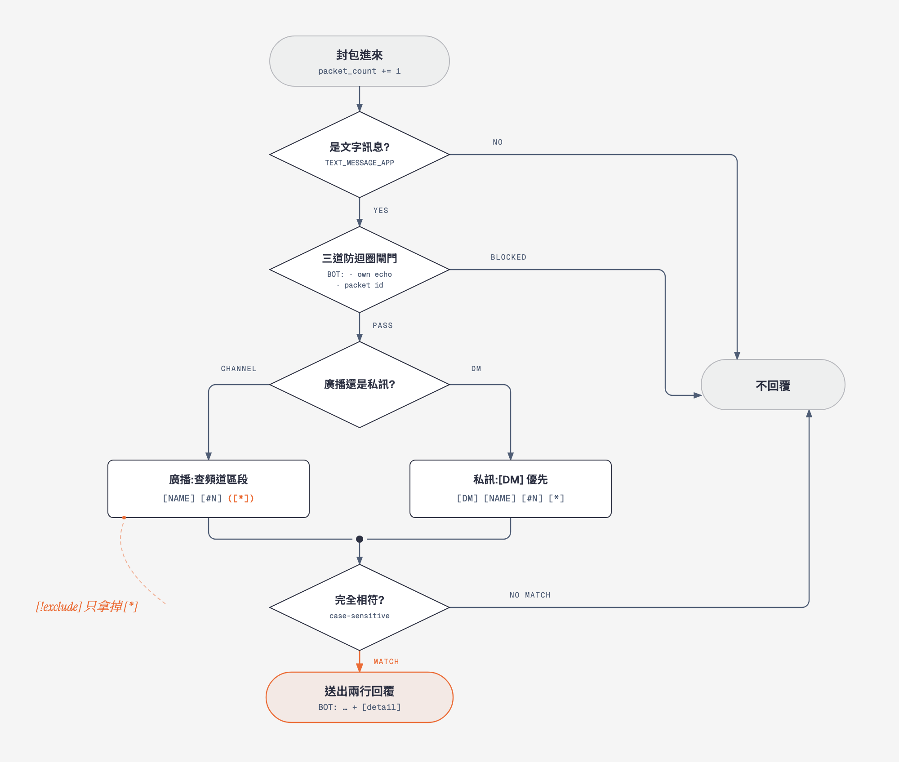

# meshtastic-bot

一個三窗格的 Meshtastic 終端介面(TUI),可以透過 **BLE / WiFi(TCP)/ USB serial** 連上節點,瀏覽並收發各頻道與 DM 的訊息,並依 `rules.txt` 做關鍵字自動回覆。

另外附一個**無 UI 的 server 模式**(`bot_server.py`),用同一套規則引擎,可以丟到背景當服務長期跑 —— 見[三個檔案該用哪一個](#三個檔案該用哪一個)。



## 安裝

換一台新機器只要兩行:

```sh
git clone https://github.com/bug1119/meshtastic-bot.git && cd meshtastic-bot
./setup.sh
```

唯一的前置是 [uv](https://docs.astral.sh/uv/),而 `setup.sh` 會處理掉它:有 Homebrew 就 `brew install uv`,沒有就用官方 installer 裝到 `~/.local/bin`(不需要 sudo);接著預先下載套件、跑一次測試確認這台機器沒問題。可以重複執行,已經滿足的步驟會直接跳過。

之後 `./bot.py` 就能直接跑,**不用建 venv、也不用 activate**。原理是 `bot.py` 的 shebang 是 `uv run --script`,而它需要的套件用 [PEP 723](https://peps.python.org/pep-0723/) 宣告在檔案開頭,uv 讀到就自己準備並快取環境。**Python 3.9 或更新**(在 3.9.6 與 3.12.1 上都實測過)這個條件也一併交給 uv —— 版本不合時它會自己抓一個合用的 Python,不動系統那支。

`setup.sh` 唯一沒辦法替你做的是 **PATH**:`./bot.py` 是由 shebang 把檔案交給 `uv`,而那要靠你當下 shell 的 PATH 找得到 `uv`。所以它會用一個全新的 login shell 去驗,找不到就直接印出該加進 `~/.zshrc` 的那行。

<details>
<summary>不想裝 uv 的話</summary>

把套件裝進任何一個 interpreter 也行:

```sh
python3 -m venv ~/.venvs/meshtastic-bot
~/.venvs/meshtastic-bot/bin/pip install textual pypubsub meshtastic
~/.venvs/meshtastic-bot/bin/python bot.py --host Meshtastic.local
```

這時要**明確寫出 interpreter 路徑**。`./bot.py` 仍然會走 shebang 交給 uv;而 `python3 bot.py` 用的是系統那支 —— 在裝了 Homebrew 的 macOS 上,它還會因為 [PEP 668](https://peps.python.org/pep-0668/) 直接拒絕 `pip3 install`(`externally-managed-environment`),這正是要開 venv 的原因。

啟動時會自己檢查那三個套件,缺哪個會直接告訴你,不會丟一串 traceback。
</details>

## 三個檔案該用哪一個

| 檔案 | 是什麼 | 什麼時候用 |
|---|---|---|
| `bot.py` | 原本的三窗格 TUI | 想看畫面、手動收發訊息 |
| `bot_dual.py` | TUI **加上** `--server` 無 UI 模式 | 想用同一支程式兩種都跑 |
| `bot_server.py` | 只有 server,**完全沒有 UI** | 長期掛在背景當服務 |

`bot.py` 不會被另外兩個影響,維持原狀。

`bot_server.py` 是**由 `bot_dual.py` 產生的**,不要手改:

```sh
./make_bot_server.py     # 改完 bot_dual.py 就跑這個重新產生
```

三者共用同一套規則引擎(`ReplyEngine`),所以在 TUI 測過的規則在 server 下行為完全一樣。
`test_rules.py` 會用 `inspect.getsource()` 逐一比對共用函式,手改 `bot_server.py` 會**讓測試失敗**,
這是刻意的 —— 兩份程式各自長歪比一次改錯更難發現。

`bot_server.py` 不需要 `textual`,所以要部署到只跑服務的機器時,少一個相依。

## 用法

三支吃的參數大致相同,差別在有沒有 UI、有沒有 server:

| 參數 | `bot.py` | `bot_dual.py` | `bot_server.py` | 說明 |
|---|:---:|:---:|:---:|---|
| `--host HOST[:PORT]` | ✅ | ✅ | ✅ | 用 TCP 連,port 預設 4403 |
| `--port PATH` | ✅ | ✅ | ✅ | 用 USB serial 連 |
| `--ble NAME` | — | ✅ | ✅ | 指定 BLE 節點名稱,跳過約 10 秒掃描 |
| `--here LAT,LON` | ✅ | ✅ | ✅ | 本機座標,用來算節點距離 |
| `--list` | — | ✅ | ✅ | 列出連得到哪些裝置,然後結束 |
| `--server` | — | ✅ | 本來就是 | 不開 UI,跑自動回覆 server |
| `--daemon` | — | ✅ | ✅ | 選好裝置後丟到背景 |
| `--log PATH` | — | ✅ | ✅ | `--daemon` 的輸出檔 |
| `--heartbeat SECS` | — | ✅ | ✅ | 多久印一行「還活著」 |
| `--mqtt` | — | ✅ | ✅ | 代節點連 MQTT broker(要跟 `--server` 一起) |
| `--wifi on\|off` | ✅ | ✅ | — | 開關節點的 WiFi 後結束 |

`bot.py` 沒有 `--ble`,是因為它本來就會掃 BLE 並列在裝置窗格裡讓你點。

### bot.py — 互動 TUI

```sh
./bot.py                                              # 掃描並連 BLE
./bot.py --host Meshtastic.local                      # 走 WiFi (TCP 4403)
./bot.py --host 192.168.0.247:4403                    # 指定 port
./bot.py --port /dev/cu.usbmodem2101                  # 走 USB serial
./bot.py --host Meshtastic.local --port /dev/cu.usbmodem2101   # 兩個都列出來,BLE 也繼續掃
./bot.py --host Meshtastic.local --here 25.0339,121.5645       # 顯示節點距離
./bot.py --port /dev/cu.usbmodem2101 --wifi on        # 只開節點的 WiFi,不啟動 UI
```

| 參數 | 說明 |
|---|---|
| `--host HOST[:PORT]` | 用 TCP 連;port 預設 4403。指定後會**立刻連線**,不用等 BLE 掃描,BLE 掃描仍會繼續 |
| `--port PATH` | 用 USB serial 連 |
| `--here LAT,LON` | 本機座標,用來算各節點距離。只在連上的節點沒有 GPS 定位時才需要。**只留在本機**,不會送給裝置或 mesh |
| `--wifi on\|off` | 開關節點的 WiFi,做完直接結束(不啟動 UI)。需要 `--port` 或 `--host` |

### bot_dual.py — 同一支,可選要不要 UI

不加 `--server` 就跟 `bot.py` 一樣是 TUI;加了就是無 UI 的 server。

```sh
./bot_dual.py                                         # 開 TUI(等同 bot.py)
./bot_dual.py --ble Bug2_1ca6                         # 開 TUI,直接連指定的 BLE 節點
./bot_dual.py --server --port /dev/cu.usbmodem2101    # 無 UI,USB
./bot_dual.py --server --host 192.168.0.247           # 無 UI,WiFi
./bot_dual.py --server --ble Bug2_1ca6 --daemon --log ~/bot.log   # 無 UI,背景
./bot_dual.py --server --ble Bug2_1ca6 --mqtt         # 無 UI,並代節點上 MQTT
./bot_dual.py --list                                  # 只列出裝置
```

多出來的參數除了 `--server` 之外,都跟 `bot_server.py` 相同(見下)。
`--daemon` 與 `--mqtt` 都必須跟 `--server` 一起用,單獨給會被擋掉。

### bot_server.py — 只有 server,沒有 UI

```sh
./bot_server.py --port /dev/cu.usbmodem2101           # USB
./bot_server.py --host 192.168.0.247                  # WiFi
./bot_server.py --ble Bug2_1ca6                       # BLE,指定名稱
./bot_server.py                                       # 不指定 → 列出裝置讓你選編號
./bot_server.py --list                                # 只列出裝置,不連線
./bot_server.py --ble Bug2_1ca6 --daemon --log ~/bot.log         # 丟到背景
./bot_server.py --port /dev/cu.usbmodem2101 --heartbeat 0        # 關掉心跳
./bot_server.py --host 192.168.0.247 --here 25.0339,121.5645     # 回覆帶 dist=
./bot_server.py --ble Bug2_1ca6 --mqtt                           # 代節點連 MQTT broker
```

| 參數 | 說明 |
|---|---|
| `--list` | 列出現在連得到哪些節點(BLE 名稱 + USB serial 埠),然後結束,不連任何一台 |
| `--ble NAME` | 指定 BLE 節點名稱,跳過約 10 秒的掃描。`--daemon` 要能無人啟動就靠這個 |
| `--daemon` | 選好裝置後丟到背景,輸出寫到 `--log`,並印出 pid |
| `--log PATH` | `--daemon` 的輸出檔,**附加**不覆蓋。預設 `meshtastic-bot.log` |
| `--heartbeat SECS` | 多久印一行「還活著」與計數。`0` 關閉,只印真正發生的事。預設 600 |
| `--mqtt` | 代節點連它設定裡的 MQTT broker:上行送出去、下行收回來。預設關閉,見 [MQTT 橋接](#mqtt-橋接--mqtt) |

一個裝置都不指定時,它會掃一遍、列出編號讓你選,選完就開始服務。

跑起來長這樣(實機輸出):

```
2026-09-03 20:23:31 連線 ble:Bug2_1ca6 ...
2026-09-03 20:23:57 BLE 已連線,等待設定同步...
2026-09-03 20:23:57 設定同步完成: BUG2 !f2dcbabe
2026-09-03 20:23:57 頻道: #0, #1 SignalTest, #2 Emergency!, #3 EDGE_ATS, #4 CLSE
2026-09-03 20:23:57 規則: [DM]=1, [EDGE_ATS]=4, [CLSE]=29
2026-09-03 20:24:03 channel:1 20:24:01 Bug2[!f2dcbabe](LoRa snr=6.5 rssi=-92): ping
2026-09-03 20:24:03   -> auto-reply: BOT: pong [20:24:01 from=Bug2 rx=LoRa snr=6.5 rssi=-92]
2026-09-03 20:24:17 [心跳] 已連線 執行 0:00:45 封包 249 收訊 22 自動回覆 1 重連 0
```

一個事件一行、附完整日期(log 是隔幾天才看的,只有時鐘看不出哪一天),而且每行都 flush,
所以 `tail -f` 看得到即時內容。心跳那行的 `封包` 跟狀態列的同一個意思 ——
包含 position / nodeinfo / telemetry,見[最底下那一列固定狀態列](#最底下那一列固定狀態列)。

### 先看有哪些裝置

```
$ ./bot_server.py --list
掃描 BLE(約 10 秒)...
BLE 節點 (2):
  --ble Bug2_1ca6    F891A520-7FDB-A7FB-998C-04A6C606B42C
  --ble bug_530c     E9FF9C79-E898-E0B8-867B-2015A1D74ECD

USB serial (0):
  (沒有接上的裝置)
```

輸出直接就是**要傳的參數**,所以那一行可以整段貼到命令列上。

BLE 掃描是用 Meshtastic 的 service UUID 過濾的,所以列出來的都是真節點,不是房間裡所有藍牙裝置。
**列不到通常不是壞掉** —— 已經連上手機 app 的節點通常就停止廣播了。

USB 那份用的是函式庫自己的 `findPorts()`,會優先挑已知的 USB-serial vendor id。

### 怎麼結束

**SIGTERM 就好 —— 也就是普通的 `kill`,或前景時 Ctrl-C。**

```sh
# 前景:Ctrl-C

# 背景:啟動時就印了 pid
$ ./bot_server.py --ble Bug2_1ca6 --daemon --log ~/bot.log
背景執行中 pid=98523, log: /Users/you/bot.log
停止: kill 98523

$ kill 98523
```

停止時 log 會留下:

```
2026-09-03 20:25:12 停止中...
2026-09-03 20:25:17 介面關閉逾時 (5s),不再等待
2026-09-03 20:25:17 已停止。[心跳] 已連線 執行 0:00:54 收訊 22 自動回覆 1 重連 0
```

那行「關閉逾時」是**正常的,不是錯誤**:macOS 上 BLE 拆線常常永遠不回來。實測過 ——
停止事件會立刻喚醒主迴圈,但接著 `close()` 就卡死,結果整個行程要 `kill -9` 才停。
所以現在給 `close()` 五秒,到了就自己走。**不需要 `kill -9`。**

`--daemon` 是**重新啟動一個乾淨的行程**,不是 `fork()`。因為 meshtastic 在 import 時
就起了一條 `publishing` 執行緒,而 `fork()` 只帶走呼叫它的那一條 —— fork 出來的子行程
會連得上、然後永遠不處理任何封包。裝置是在 fork **之前**選好的,所以背景那份不需要終端機。

### 掛成開機服務(launchd)

```xml
<!-- ~/Library/LaunchAgents/com.local.meshtastic-bot.plist -->
<key>ProgramArguments</key>
<array>
  <string>/usr/bin/python3</string>
  <string>/Users/you/meshtastic-bot/bot_server.py</string>
  <string>--port</string><string>/dev/cu.usbmodem2101</string>
</array>
<key>KeepAlive</key><true/>
<key>StandardOutPath</key><string>/Users/you/bot.log</string>
```

這種情況**不要**加 `--daemon`:launchd 要自己盯著行程,所以讓它跑在前景、
由 `StandardOutPath` 收 log 就好。

### 按鍵

| 鍵 | 動作 |
|---|---|
| `←` `→` | 在三個窗格間移動(在輸入框內則是移動文字游標) |
| `↑` `↓` | 各窗格原本的行為 —— 清單移動游標、log 捲動 |
| `Tab` / `Shift+Tab` | 循環所有可聚焦元件,含本機狀態窗格 |
| `R` | 重新掃描裝置 |
| `Q` | 離開 |

## 環境

開發與所有實測都在 **macOS** 上:

| | |
|---|---|
| OS | macOS 26.6.2(arm64,Apple silicon) |
| Python | 3.12.1 |
| meshtastic | 2.7.11 |
| pypubsub | 4.0.7 |
| textual | 8.2.8(`bot_server.py` 不需要) |
| 實測節點 | GAT562 (`Bug2_1ca6`) 走 BLE、Heltec V4 TFT 走 USB / WiFi |

那台 Heltec V4 TFT 的韌體踩到四個上游 `device-ui` 的 bug(每 55 秒重開、開地圖必炸),
成因、解 backtrace 的方法與修法整理在 **[`docs/firmware/`](docs/firmware/)**。跟這支 bot 無關,
但同一台節點,查起來會用到。

**BLE 只在 macOS 驗過。** Linux 上 bleak 走的是 BlueZ,行為不同(尤其配對與掃描),
沒試過。USB serial 與 TCP 兩條路沒有平台相依的東西,但也沒在別的系統上跑過。

macOS 特有的兩件事,程式裡有處理:

- **首次使用 BLE 會跳藍牙權限**,要允許執行的那個終端機程式(不是 Python 本身)
- **BLE 拆線常常永遠不回來**,所以 server 關閉時給 `close()` 五秒就走 ——
  詳見[怎麼結束](#怎麼結束)

## 記憶體用量

`ps` 的 RSS,連上真實節點後每 2 秒取樣一次(上面那台 macOS):

| 程式 | 只 import | 跑起來(峰值 RSS) |
|---|---|---|
| `bot_server.py` | **46 MiB** | **72 MiB**(連上,無 UI) |
| `bot_dual.py --server` | 60 MiB | 82 MiB(連上,無 UI) |
| `bot_dual.py`(TUI) | 60 MiB | 98 MiB(連上,含 `--here`) |
| `bot.py`(TUI) | 58 MiB | 87–88 MiB(掃描中,**尚未連線**) |

「只 import」那欄是**還沒做任何事**、相依套件的成本。`bot_server.py` 少 14 MiB
就是不必載 `textual` 的差別;跑起來仍然少約 10 MiB。要長期掛著跑的話,這是選它的理由之一。

`bot.py` 那格是掃描中未連線的狀態 —— 它沒有 `--ble`,而當下 USB 沒接、TCP 那台又被
本機 VPN 擋住,沒辦法在同一輪自動連上。**它的 TUI 跟 `bot_dual.py` 是同一份程式**,
所以連上後應該落在 98 MiB 附近。

幾個要注意的地方,免得把這些數字當成保證:

- **RSS 含共用頁**,所以幾支同時跑的總量會小於單純相加
- 數值在**第一次取樣就到位**,之後 70 秒沒有成長,三次獨立執行的結果一致 —— 但 70 秒**不是漏記憶體的檢測**
- server 端唯一會隨時間累積的東西(每個對話的回覆歷史)是**有上限的**
  (`_BoundedHistory`,每個對象 50 行),所以掛幾週不會靠它長大
- 節點的 node DB 越大,設定同步時倒過來的資料就越多。這裡的節點約 240 個節點;
  mesh 更大的話起始值會更高

## 最底下那一列固定狀態列

畫面最下方永遠有一列,每秒更新:

```
執行 3:24:07   封包 4821   收 128   發 41 (自動 39)   重連 2 次
```

| 欄位 | 意思 |
|---|---|
| `執行` | 這個程式跑了多久(`H:MM:SS`)。用 `time.monotonic()`,所以系統時鐘被校正也不會跳 |
| `封包` | 節點交上來的**所有**封包,不分種類(position / nodeinfo / telemetry / 解不開的加密封包都算)。文字訊息很稀少,這些卻一直在流,所以這是「連線還活著嗎」最靈敏的那個數字 |
| `收` | 收到的文字訊息數,**不含自己這台的回音** —— 否則送一則會同時算成收 1 發 1 |
| `發` | 送出的**總數**,括號裡是其中自動回覆的數量。`發 41 (自動 39)` 是「41 則裡有 39 則是 bot 回的」,不是 41+39 |
| `重連` | 斷線時顯示**這次**是第幾次嘗試(紅字);接回來之後改顯示**整個 session 的累計次數**(暗色),所以離開一陣子回來也看得出連線有沒有一直在抖。從沒斷過就不顯示這欄 |

小時不會折成天:跑好幾天時 `51:03:12` 一眼就能跟 log 的時間戳對照,`2d 3:03:12` 還要心算一下。

**`封包` 開場會先跳一大筆,那不是空中流量。** 實測連上節點的**同一秒**就湧入 249 個封包(130 個 `POSITION_APP` + 119 個 `TELEMETRY_APP`),之後 89 秒一個都沒有。那是設定同步時節點把自己 node DB 裡存的資料透過 API 倒過來 —— LoRa 在 MEDIUM_FAST/250kHz 下一秒鐘塞不進 130 個封包,光空中時間就不可能。所以開場那筆的量級大致等於「node DB 裡有位置/遙測的節點數」,**要看真實流量請看它從那個數字往上爬多少**,不是看絕對值。

這裡刻意不把開場那筆濾掉:寧可數字誠實、規則簡單(就是「節點交上來的每一個封包」),也不要偷偷從某個時間點才開始算而讓人對不上帳。

注意「執行」與本機狀態窗格的 `Uptime:` 是**兩件事** —— 後者是**節點自己**開機多久(節點回報的,分鐘精度,沒資料時顯示 `--`)。程式裡也是兩個函式(`format_elapsed` 與 `format_uptime`),當初把它們取同名會讓後定義的那個靜靜蓋掉前面那個,有測試鎖住這件事。

## 斷線與自動重連

連線掉了會在狀態列用紅字說,狀態窗格的「連線:」那行也會變成 `TCP 中斷,重連中`,然後自動重試,間隔 **1 → 2 → 5 → 10 → 30 秒**,之後固定每 30 秒一次,直到接回來或你離開程式。重連成功後會重新做一次設定同步,所以頻道與 node 清單會一起更新(斷線期間才第一次聽到的節點也會補進來)。`history` 不會清掉,已經收過的訊息還在。

**為什麼需要這個**:meshtastic 套件的 reader thread 在 `StreamInterface.__reader` 裡對 `OSError` 的處理是「記一行 log,然後在 `finally` 呼叫 `_disconnected()`」—— 而 **TCP timeout 就是 `OSError` 的子類**(`TimeoutError`)。那個 thread 就此永久結束,套件**只有**在對方乾淨關閉(`recv` 回 `b""`)時才會自己重連,錯誤路徑不會。

所以在加上這段之前:**連線一斷,bot 的畫面還一直寫著「已連線」、狀態列一個字都不說,而且從此再也收不到任何封包。** 之後別台傳過來的訊息全部看不到,而且沒有任何提示 —— 這就是「好像會掉訊息」的真正原因,不是漏掉一兩則,是斷線之後全丟。

**能救回多少**:重連本身不會把斷線期間的訊息變出來。韌體的 `toPhoneQueue` 有限的緩衝會在重連後送出一部分,超出的就是真的沒了。這個修正保證的是「不會無聲無息地永久停擺」。

## MQTT 橋接:`--mqtt`

節點自己上不了 MQTT broker 的時候,由這支程式代它上。只能跟 `--server` 一起用:

```sh
./bot_server.py --ble Bug2_1ca6 --mqtt
./bot_dual.py --server --ble Bug2_1ca6 --mqtt --daemon --log ~/bot.log
```

**為什麼需要**:ESP32 的韌體只在 WiFi 不可用時才開藍牙(`src/platform/esp32/main-esp32.cpp`),所以用 BLE 連的節點**必然沒有自己的網路** —— 它上 MQTT 的唯一路徑是 `mqtt.proxy_to_client_enabled`:節點把每一則 MQTT 交給當下連著的 client,由那個 client 去連 broker。手機 app 有做這件事,所以把手機換成這支程式之後,節點的 MQTT 就整段掉在地上,而且沒有任何訊息說它掉了。

**預設關閉是刻意的。** 一個自己啟動的橋接,等於把一個你可能當成私有的 mesh 開始轉發到裝置上寫著的那台 broker —— 而沒改過的設定寫的就是公共那台。要不要把訊息送上網路是一個決定,不該由「bot 開起來了」代你做。

### 兩個條件,缺一不可

1. **節點上** `mqtt.enabled` 和 `mqtt.proxy_to_client_enabled` 都要開 —— 這決定節點願不願意把 MQTT 交出來
2. **這支程式**要帶 `--mqtt` —— 這決定有沒有人接

只做第一件,節點把訊息交出來但沒人接;只做第二件,橋接啟動不了。兩種都是訊息安靜地不見。

差別是這支程式**會講**是哪一個沒到位,這正是韌體不做的事:

```
MQTT: 節點的 mqtt.enabled 是關的,不啟動橋接
MQTT: 節點的 proxy_to_client_enabled 是關的,不啟動橋接
```

### 藍牙、WiFi、USB 都可以,但意義不同

橋接是搭在**「client 連線」**上的,不管那條連線是什麼 —— 它就是對手上那個 interface 物件呼叫 `sendMqttClientProxyMessage()`,`BLEInterface` / `TCPInterface` / `SerialInterface` 一視同仁。程式裡沒有任何連線方式的限制,唯一一條檢查是 `--mqtt` 要跟 `--server` 一起用。

```sh
./bot_server.py --ble Bug2_1ca6 --mqtt                    # 藍牙
./bot_server.py --port /dev/cu.usbmodem1101 --mqtt        # USB serial
./bot_server.py --host 192.168.1.50 --mqtt                # WiFi / TCP
```

但三種情境下這個參數的必要性不一樣:

| 連線方式 | 節點自己有網路嗎 | `--mqtt` 的角色 |
|---|---|---|
| **藍牙** | **沒有** —— ESP32 只在 WiFi 不可用時才開 BLE | **必要**,唯一出路 |
| **USB serial** | 看 WiFi 有沒有開;關著就沒有 | WiFi 關著時**必要** |
| **WiFi / TCP** | **一定有**(不然連不到它) | **多繞一圈**,節點本來就能自己送 |

最後一列要特別小心:你能用 `--host` 連上它,就代表它有網路、本來就會自己連 broker。這時候把 `proxy_to_client_enabled` 打開,反而讓**節點停止自己連** —— `MQTT::publish()` 裡 proxy 那支直接 `return`,底下的 `else if (isConnectedDirectly())` 永遠不會跑到:

```c
if (moduleConfig.mqtt.proxy_to_client_enabled) {
    service->sendMqttMessageToClientProxy(msg);
    return;                        // ← 互斥,不會落到直連
}
else if (isConnectedDirectly()) { ... }
```

所以 proxy 不是「多一條路」而是**換一條路**。有 WiFi 還開 proxy,唯一合理的用途是節點的網路連不到 broker、而跑這支程式的機器連得到。

### 手機 app 裡的 MQTT 設定,不是手機的設定

這點很容易誤解:手機 app 的 MQTT 畫面是在編輯**節點上的** `moduleConfig.mqtt`,手機自己沒有 broker 設定。所以「手機 app 設好了 MQTT」等於「節點的 MQTT 設定填好了」,跟誰來連 broker 是兩回事。

手機 app 唯一多做的事,是它**內建了 client proxy 的那一半**。所以節點只要開了 proxy、手機連著,就會通;把手機換成這支程式,就得靠 `--mqtt` 補上同一半。

### 為什麼韌體不會警告你

節點沒有網路、proxy 又關著的時候,MQTT **連嘗試都不會嘗試**(`src/mqtt/MQTT.cpp`):

```c
bool wantsLink()
{
    return hasChannelorMapReport &&
           (moduleConfig.mqtt.proxy_to_client_enabled || isConnectedToNetwork());
}
```

封包則落到 `else` 那支,進一個深度 16 的佇列,滿了就丟最舊的:

```
LOG_INFO("MQTT not connected, queue packet");
LOG_WARN("MQTT queue is full, discard oldest");
```

韌體其實**有**一句話正是為這個情況寫的:

> `Invalid MQTT config: proxy_to_client_enabled must be enabled on nodes that do not have a network`

**但有 WiFi 硬體的板子看不到它。** 它在 `#if HAS_NETWORKING` 的 `#else` 分支裡,而 `HAS_NETWORKING` 是 `HAS_WIFI || HAS_ETHERNET`(`src/configuration.h`)—— **編譯期**的板子能力,不是執行期「現在有沒有連上」。Heltec V4 有 WiFi 硬體,所以那句錯誤根本沒被編進去;走的是另一支,它只在 `isConnectedToNetwork()` 為真時去測 broker 通不通,而走 BLE 時這個是假,於是**什麼都不做,設定照存,零錯誤零警告**。

也就是說:那句診斷只給沒有 WiFi 硬體的板子看,而 ESP32 全系列都有。設定看起來完全正常、訊息就是不會出去,也沒有任何一行 log 說為什麼 —— 這是設定 MQTT 時最花時間的一個坑。

### broker 從節點讀,不寫在這裡

address / username / password / root / TLS 全部在**連上之後從節點讀**(`localNode.moduleConfig.mqtt`),所以在裝置上改完、重連一次就生效,程式裡不用跟著改。只有欄位是空的才退回韌體自己的預設值(`src/mesh/Default.h`):`mqtt.meshtastic.org`、`meshdev` / `large4cats`、root `msh`。

`address` 空白時**連帶不採用**存著的帳密 —— 這是韌體 `PubSubConfig` 的行為:給某台 broker 的帳密,對另一台來說是錯的帳密。

port 沒有設定項,跟韌體一樣由 TLS 決定:`tls_enabled` 開就是 **8883**,關就是 **1883**。要連別的 port 就把 address 寫成 `host:port`。

TLS **會驗證憑證**,跟韌體的 `setInsecure()` 不同 —— ESP32 沒有 CA bundle 可以比對,這台機器有。用自簽憑證的私有 broker 會在這裡被拒絕,並且在 log 上說出來,而不是安靜地放過去。

### 下行訂閱哪些 topic

proxy 模式下**韌體不會告訴 client 要訂什麼** —— `MQTT::sendSubscriptions()` 只在它自己開 socket 的那條路上跑。所以訂閱清單是這邊決定的,兩個來源:

- **有名字、而且 `downlink_enabled` 開著的頻道**:直接組出 `<root>/2/e/<頻道名>/+`
- **沒名字的主頻道**:韌體會拿**調變預設的顯示名稱**(`MediumFast`、`LongFast`……)當它的 topic 名字,而那個值不在讀得到的設定裡 —— 所以是從節點自己 publish 的 topic **學**來的。與其在這邊再抄一份韌體的預設表,不如讓節點自己講

再加上 `<root>/2/e/PKI/+`,私訊走那個假頻道進來。

**沒有訂 `<root>/2/map/`**:那上面是 MapReport,而節點對 client 交回去的東西一律當 ServiceEnvelope 解(`onReceiveProto`),解不開只會在節點上留一行錯誤。map 是只上不下的。

`downlink_enabled` 關著的頻道不訂 —— 節點收到也會丟掉,訂了只是白花 BLE 頻寬。所以**一個 downlink 都沒開的節點訂閱數會是 0**,那是對的,不是壞了。

### log 只記狀態變化,量看心跳

橋接**不會**一則訊息印一行。這個 mesh 一分鐘幾百個封包,一則一行的話 log 就沒得看了。所以只有狀態變化留一行,量放在心跳:

```
2026-09-04 21:10:33 MQTT 橋接啟動: mqtts://mqtt.meshtastic.org:8883 root=msh/TW 下行 topic 3 個
2026-09-04 21:10:35 MQTT 已連線 mqtt.meshtastic.org:8883,訂閱 3 個下行 topic
2026-09-04 21:20:33 [心跳] 已連線 執行 0:10:03 封包 4821 收訊 12 自動回覆 3 重連 0 MQTT 已連線 上行 271 下行 188
```

broker 斷線也是一行,而且**一次斷線只講一次**,不是每次重試都講 —— broker 掛掉通常掛好幾個小時,重試間隔在程式裡是固定的,真正需要知道的「現在還是斷的」在心跳那行。重連間隔跟連線斷線用**同一張表**:1 → 2 → 5 → 10 → 30 秒,之後固定 30 秒。

### broker 掛掉不會把 bot 拖下去

橋接是側路,壞了只壞它自己:

- 兩個方向的 callback 都包起來,**例外不會逸出** —— 上行跑在 meshtastic 的 publishing thread 上(就是把每個封包交給 `on_receive` 的那條),下行跑在 paho 的網路 thread 上。任何一條被例外殺掉,壞的都不是 MQTT 而是別的東西
- 同一種錯誤只印一行,之後只累加心跳的 `錯誤` 計數
- 連 broker 是在**自己的 thread** 上做的,不是在設定同步那條路上,所以連不到的 broker 不會讓 bot 停下來不回訊息
- 節點的 `mqtt.enabled` 或 `mqtt.proxy_to_client_enabled` 關著,就印一行說是哪一個然後不啟動 —— 那是裝置設定,要改的地方在裝置上
- 關閉時 broker 的 disconnect 跟 `interface.close()` 一樣有上限(3 秒),因為 socket 一樣會卡

### 需要 paho-mqtt

`--mqtt` 需要 [paho-mqtt](https://pypi.org/project/paho-mqtt/)。走 shebang 交給 uv 的話已經宣告在檔頭,不用管。

它**刻意不在啟動時的必要套件檢查裡** —— 沒有要用橋接的機器,不該因為一個不會被 import 的套件被擋著不能啟動。改成給了 `--mqtt` 才檢查,而且**在連線之前**就檢查完:BLE 連上要半分鐘,如果又是 `--daemon`,半分鐘之後才噴的錯誤沒人看得到。

### ⚠️ 這會把訊息送上網路

沒改過的設定指向**公共 broker**,而公共頻道的 PSK 是公開的。所以公共頻道上的訊息,橋接開起來之後就會出現在網路上任何人都看得到的地方 —— 這本來就是 Meshtastic MQTT gateway 的作用,但值得在打上 `--mqtt` 之前想一次。不想要就不要加這個參數,或者在裝置上關掉那些頻道的 `uplink_enabled`。

## 未讀:頻道/node 列表的粗體

中間窗格的某一列變**粗體**,表示那個頻道(或那個 node 的私訊)在你沒看著它的時候收到了訊息。**選到它就恢復一般字體** —— 所以切到別的頻道後,剛才看過的那個仍然是一般字體,只有還沒看的才是粗體。

幾個刻意的決定:

- **正在看的目標不會變粗體。** 訊息就在你眼前寫進訊息窗格了,標成未讀只會變成一個要「切走再切回來」才消得掉的假訊號
- **私訊也算**,node 那一列同樣會變粗體。中間窗格本來就同時放頻道與 node,而漏掉的私訊通常比漏掉的公共頻道訊息更要緊
- **自己送出的訊息與 bot 的自動回覆不會標未讀**,那些是自己造成的
- node 那一列的節點 ID 保持暗色 —— 粗體是套在整列外層,`[dim]` 在裡面,兩個樣式疊加而不是互相取代
- 列表只在設定同步時建一次,所以**之後才第一次聽到的節點還沒有自己的那一列**。未讀狀態仍然會記著,列表若重建就會顯示出來

## 三種傳輸的取捨

| | 優點 | 限制 |
|---|---|---|
| **BLE** | 有配對 PIN | 一次只能一個 client。**在 MUI/TFT 機種上開藍牙會讓螢幕進 programming mode**,等於失去畫面 |
| **TCP** | 跨房間、不用線 | **沒有加密、沒有密碼**(見下方安全性)。韌體一次只收一條 TCP 連線,新連線會踢掉舊的 |
| **serial** | 最可靠,WiFi/藍牙都關掉時唯一的路 | 要接線 |

## ⚠️ 安全性:TCP 連線沒有加密也沒有密碼

這點值得單獨說明,因為它不直觀:

- **傳輸沒有加密** —— Meshtastic 的 socket API 是明文的 protobuf,整條路徑沒有 TLS
- **沒有任何認證** —— 韌體裡有 per-connection 認證機制(`MESHTASTIC_PHONEAPI_ACCESS_CONTROL`),但在 MUI/TFT 機種上**編譯不進去**(與 MUI 必需的 `USE_PACKET_API` 互斥)
- **本機連線等於完整管理權** —— 任何能連到 `<node>:4403` 的人,都能讀全部訊息與設定、改設定、以你的身分發訊息
- 而且 mDNS 會主動廣播節點,不用掃描就找得到

**仍然受保護的是 LoRa 空中傳輸本身**(頻道 PSK、DM 用 PKC)。API 這條連線是那層加密**之外**的明文視窗。

建議:節點放在可信的 LAN,**不要把 4403 對外 port forward**,不用的時候用 `--wifi off` 關掉。

### WiFi 開關

```sh
./bot.py --port /dev/cu.usbmodem2101 --wifi off         # 關
./bot.py --port /dev/cu.usbmodem2101 --wifi on          # 開
```

**WiFi 關掉之後只有 USB 或裝置螢幕能開回來** —— 因為開 WiFi 這個指令沒辦法透過 WiFi 下,而 MUI 機種的藍牙預設是關的。裝置螢幕上的方式是 **home 畫面的 WLAN 按鈕長按**(短按無效)。

用 `--host` 關 WiFi 會先警告,因為那會切斷你自己正在用的連線。兩種方式都會讓裝置重開機才生效。

## 訊息處理流程



一則封包從節點進來、到變成一則回覆,中間要過的關卡。三件事值得從圖上讀出來:

- **計數在過濾之前。** `packet_count` 算的是**所有**封包,不是只有文字訊息 —— position / nodeinfo / telemetry 一直在流,文字訊息很稀少,所以那個數字才是「連線還活著嗎」的靈敏指標
- **三道閘門都是為了防迴圈。** `BOT: ` 前綴、自己的回音、封包 id 去重 —— 任何一道擋下就不回。詳見[自動回覆規則](#自動回覆規則rulestxt)
- **廣播與私訊查的區段不同。** 圖上那個橘色的 `([*])` 是重點:廣播在被 `[!exclude]` 列出的頻道上**沒有** `[*]`,而私訊不管走哪個頻道都有

兩張圖的原始檔都在 `docs/` 底下,是單一自帶樣式的 HTML,瀏覽器直接開就能看
(`tui-layout.html` 是上面那張介面圖,`message-flow.html` 是這張流程圖)。README 嵌的 PNG 由它們產生:

```sh
./docs/render_png.py                    # 全部重畫,預設 2x
./docs/render_png.py tui-layout.html    # 只重畫其中一張
./docs/render_png.py --scale 3          # 3x,列印用
```

需要 Chrome —— 它會把 SVG 包成一個尺寸剛好等於 `viewBox` 的頁面再截圖,所以不需要裁切。

**用 PNG 而不用 SVG 是刻意的** —— GitHub 會 sanitize 內嵌的 SVG,遠端 web font 載不到,中文標籤會退回讀者本機的字型;PNG 把字型烤進去了。

## 自動回覆規則:`rules.txt`

`rules.txt` 在版控裡,所以規則會跟著 repo 一起同步。檔案不存在時 bot 會用內建的 `DEFAULT_RULES` 自動建一份起始檔。

依頻道分區。每則進來的訊息都會重讀這個檔,所以**改完立即生效,不用重啟**。

```ini
[!exclude]          # 這些頻道不套用 [*],一行一個
#0                  # 主頻道:公共頻道,不要 blanket 回覆
SignalTest          # 也可以用頻道名稱

[DM]                # 私訊專用,優先於頻道規則
ping=pong (私訊)

[EDGE_ATS]          # 用頻道名稱
ping=pong
help=指令: ping

[#0]                # 用索引 —— 主頻道通常沒有名字,只靠名稱定位不到
status=ok           # #0 雖然被排除,但明確寫給它的規則照樣生效

[*]                 # 套用到所有頻道 —— 但不含 [!exclude] 列出的
hello=hi
```

**上面這份設定,實際會怎麼回**(每一列都是跑出來的,不是讀出來的):

| 進來的訊息 | 回覆 | 為什麼 |
|---|---|---|
| `#0` 廣播 `hello` | **不回** | `#0` 在 `[!exclude]` 裡,`[*]` 不套用 |
| `#0` 廣播 `status` | `BOT: ok` | `[#0]` 是明確寫給它的 —— **排除只拿掉 `[*]`,不是關掉整個頻道** |
| `SignalTest` 廣播 `hello` | **不回** | 同樣被排除 |
| `EDGE_ATS` 廣播 `hello` | `BOT: hi` | 沒被排除,`[*]` 生效 |
| `EDGE_ATS` 廣播 `ping` | `BOT: pong` | `[EDGE_ATS]` 優先於 `[*]` |
| `EDGE_ATS` 廣播 `help` | `BOT: 指令: ping` | 同一區段的另一條 |
| 走 `#0` 進來的 DM `hello` | `BOT: hi` | **DM 不受排除影響** |
| 走 `#0` 進來的 DM `ping` | `BOT: pong (私訊)` | `[DM]` 優先於任何頻道規則 |
| 走 `EDGE_ATS` 進來的 DM `ping` | `BOT: pong (私訊)` | 同上 —— `[DM]` 贏過 `[EDGE_ATS]` 的同名關鍵字 |

其中最容易誤解的是第二列:**把頻道列進 `[!exclude]` 不是「這個頻道不回話」,而是「這個頻道不吃 blanket 規則」。** 想完全不回,就是不要為它寫任何規則。

- 比對是**整句完全相符,而且區分大小寫** —— 只忽略前後空白。所以 `A=Alpha` 只回 `A`,不回 `a`,也不回 `AAA`
- **別台的訊息會回,自己這台打的也會回**(方便單機測試);但**以 `BOT: ` 開頭的一律不回**,這是迴圈防護
- **每則訊息最多回一次**,就算 mesh 透過 rebroadcast 或 MQTT 重播也一樣
- **頻道自己的規則優先於 `[*]`**,第一個命中的規則勝出
- 回覆文字是**原文照用**,不要加引號 —— 加了引號會被當成訊息內容送出去
- **DM 也會自動回覆**,而且回覆是以 DM 送回去的。規則先找 `[DM]` 區段,沒有命中才退回「DM 進來的那個頻道」的規則 —— 所以同一個關鍵字可以在私訊給不同答案,或者不寫在 `[DM]` 裡就直接沿用頻道的
- 第一個 `[頻道]` 之前的規則會落到 `[*]`(舊的扁平格式因此仍可用),但那會**在公共頻道也自動回覆**,所以建議一律寫明確的區段標頭

### `[!exclude]`:哪些頻道不套用 `[*]`

`[*]` 是「什麼都回」的預設值,而在一個熱鬧的公共頻道上,「什麼都回」就是變成噪音的方式。把頻道列進 `[!exclude]` 會**只拿掉 `[*]`**,該頻道仍然照它自己的 `[頻道名]` / `[#index]` 規則回覆。

```ini
[!exclude]
SignalTest      # 頻道名稱
Emergency!
#0              # 或索引 —— 主頻道通常沒有名字,這是唯一指得到它的寫法
```

完整的搭配範例與「哪一則會回、哪一則不會」的對照表在[上面](#自動回覆規則rulestxt)。

出貨預設就排除了 `SignalTest`、`Emergency!`、`LongFast`、`MediumFast`、`MeshTW`。**刪掉一行就恢復** `[*]` 在那個頻道的作用。

三件容易踩的事:

**1. `#0` 通常才是你要排除的那個。** `LongFast` / `MediumFast` 是**調變預設**的名字,不是頻道名稱。主頻道在 Meshtastic 上通常**沒有名字**(`name` 是空字串),所以寫 `LongFast` 對不上任何東西 —— 要排除主頻道只能寫 `#0`。連線時的覆蓋報告會直接告訴你哪幾行**沒有排除到任何東西**:

```
[*] 不適用於這些頻道: Emergency!, LongFast, MediumFast, MeshTW, SignalTest
[!exclude] 的 LongFast, MediumFast, MeshTW 對不上這台的任何頻道,沒有排除到任何東西
```

這個警告存在的理由是:**設錯了跟設對了長得一模一樣** —— 那一行就在檔案裡、讀起來也對,但什麼都沒排除到,直到 bot 在你不希望的地方回話你才知道。

**2. 私訊(DM)不受影響。** 排除是為了擋**廣播**流量。私訊是指名給你的,所以就算它剛好走在被排除的頻道上,`[*]` 對它仍然有效:

| 訊息 | 查的區段 |
|---|---|
| `SignalTest` 頻道廣播 | `[SignalTest]` `[#1]` —— **沒有 `[*]`** |
| 走 `SignalTest` 進來的 DM | `[DM]` `[SignalTest]` `[#1]` `[*]` |

**3. `#` 在這個區段裡有兩種意思。** 單獨一個 `#` 加數字(`#0`、`#12`)是頻道索引;其他以 `#` 開頭的都還是註解,`# 這是主頻道` 照樣是註解。

連線時會在狀態列報告覆蓋情況:哪些頻道有規則、`[*]` 實際套用到哪裡(以及排除了哪些)、**對不上任何頻道的區段**,還有**沒排除到任何東西的 `[!exclude]` 項目** —— 這幾種錯誤如果不講,都只會靜靜地不生效。

自動回覆是兩行 —— 規則的回覆,加上一行方括號括起來的訊息細節:

```
BOT: pong
[12:34:56 from=Bug2 rx=LoRa snr=6.5 rssi=-92 dist=5.0km]
```

方括號裡**每個欄位都是在描述「被回覆的那則訊息」**,不是描述回覆本身:收到的時間、發話者、接收途徑(`rx=LoRa` 是真的走無線電、`rx=MQTT` 是從網路閘道橋進來的)、訊噪比、訊號強度、距離。`rx` 這個命名與 `snr`/`rssi` 同語族 —— 它們在協定裡本來就叫 `rxSnr`/`rxRssi`。

時間若前面帶 `~`,表示節點沒報時間、用的是本機時鐘(見[`~` 是什麼意思](#-是什麼意思))。

`snr` / `rssi` / `dist` 算不出來就整個欄位不出現(LoRa 承載有限,不塞沒用的欄位)。MQTT 橋進來的訊息本來就沒有無線電收訊數據,所以那幾個欄位通常一起消失。`from=` 用短名稱,名稱還沒到就退回節點 ID。

**`BOT: ` 前綴是迴圈防護的關鍵** —— bot 會回自己這台發的訊息(所以不用第二台就能測),但任何以 `BOT: ` 開頭的訊息一律不回,所以回覆不會引發回覆。

## 訊息裡的發話者名稱

訊息視窗的格式是 `短名稱[裝置ID]`,短名稱取 `shortName`,沒有就退到長名稱,兩者都沒有才只顯示節點 ID:

```
12:34:56 Bug2[!f2dcbabe](LoRa snr=6.5 rssi=-92): ping
```

名稱是透過獨立的 NodeInfo 封包送來的,所以剛聽到、還沒收到名稱的節點會先只顯示 ID(`!a08b0694`),之後自動補上名稱。

方括號在程式裡是**轉義**的(`\[`)—— RichLog 把這行當標記解析,未轉義的 `[!f2dcbabe]` 會被當成樣式標籤而不會顯示出來。有一項測試鎖住這個轉義。

狀態窗格**同時保留名稱與 ID**(`from=Bug2 (!f2dcbabe)`)—— 那是診斷用的視圖,而名稱既不唯一也不保證存在。

## 節點距離

節點列表與自動回覆都會顯示距離,用 haversine 計算。需要**兩端都有位置**:

- **本機**:節點自己的 GPS 定位,或用 `--here LAT,LON` 指定
- **對方**:該節點有廣播位置

算不出來時顯示 `--`,而且狀態列會**指出缺哪一端**,不會留一整排沒解釋的 `--`。

`--here` 只影響本機計算,**不會寫進裝置也不會廣播到 mesh**。若要讓節點對外宣告位置,那是裝置的 `fixed_position` 設定,有隱私影響。

以下三種都視為「無定位」:沒有 position、只有 timestamp(GPS 開著但沒定位的實際回報)、以及 `0,0` 佔位值。

## `~` 是什麼意思

`~` 一律表示**這個值是本機推導的,不是節點回報的**。出現在兩個地方。

### 訊息時間:`~23:54:28`

訊息的時間戳來自封包的 `rxTime`,那是**節點自己的時鐘**。而從沒收到過 GPS 定位、也沒接過手機的節點會回報 0 —— 這對放在桌上的節點是常態,不是例外。

那種情況下改用**本機的時鐘**:訊息是一進來就解析的,兩者相差不到一秒,比印一排問號有用得多。加上 `~` 說明它是這裡推導的:

```
~23:54:28 Bug2[!f2dcbabe](LoRa snr=11.0 rssi=-37): Q
  -> auto-reply: BOT: Quebec [~23:54:28 from=Bug2 rx=LoRa snr=11.0 rssi=-37]
```

節點有報時間時就直接用它的,**不加 `~`**。想讓它報真的時間就把節點的時鐘設好(接手機 app 一次,或給它 GPS 定位)。

### 本機狀態窗格的頻率與頻寬

`頻率` 與 `Bandwidth` 前面的 `~` 同樣表示**推導值,不是節點回報的**。

原因是節點回報的是**儲存的**設定,不是實際生效的參數。當 `use_preset` 為真(這是常態)時,`bandwidth` 會留在 0、`override_frequency` 留在 0.0 —— 因為韌體是在執行期從 region + preset + 頻率槽推導,推導結果不會回傳。

`lora_params.py` 依韌體的表重建這些值。兩個防漂移設計:

- **以 protobuf enum 名稱為鍵,不用編號** —— 安裝的 meshtastic 套件與韌體的 enum 編號已經不一致,用編號會靜靜錯位
- **推導不出來就顯示「無法推導」**,不猜。例如頻率槽為 0 時韌體會用頻道名稱的 hash 決定,那需要這裡沒有的狀態

因為是鏡像韌體邏輯,**上游改頻段規劃時需要跟著更新**。來源檔案與函式都寫在 `lora_params.py` 的 docstring 裡,方便日後比對。

## 測試

```sh
./test_rules.py
```

600 項檢查,不需要 pytest 也不需要硬體(但因為它直接 `import bot_dual`,所以仍要那幾個套件 —— shebang 已經處理好了)。涵蓋規則解析與優先序、連線時的規則覆蓋回報、裝置 key 與 host:port 解析、中文顯示寬度、位置擷取與距離、頻率/頻寬推導、未讀粗體、斷線偵測與重連退避、狀態列的執行時間與封包/收發計數,自動回覆的文字組成,以及 server mode:回覆行為、無 markup 的純文字輸出、裝置選單與 `--list`、背景啟動的命令列(特別是**不能**把 `--daemon` 傳給子行程,否則會無限衍生)、有界的訊息歷史、設定同步比 interface 指派更早到的競態,還有 `close()` 卡死時的有界關閉。MQTT 橋接也在裡面:broker 設定從節點讀出來、上行 publish 與下行回灌、沒給 `--mqtt` 時完全不動、paho 的例外不會逸出、重連沿用同一張退避表,以及 disconnect 卡住時的有界關閉 —— paho 是假的,不碰網路。

另外有 `test_params_live.py`,**需要硬體**:它把三支程式的每一個參數都跑一遍
(`--help`、每一種該被擋下來的參數組合、連不上的目標要乾淨失敗、`--list`、
真的連上節點、`--daemon` 背景啟動後用 `SIGTERM` 停掉),並在連線期間取樣記憶體。
`--wifi` 只測參數檢查,不會真的去改節點設定;`--mqtt` 同理,真的連 broker 那一項要另外給 `--mqtt-live` 才跑,因為那會把這個 mesh 轉發到公共 broker 上。

```sh
./test_params_live.py            # 需要一台在廣播的 BLE 節點
```

其中未讀粗體有一項是**唯一會真的把 App 跑起來**的測試(Textual 的 headless 模式,仍然不需要硬體)—— 因為「找到那一列並重畫」這件事只有真的 widget 在時才存在,假造的 self 測不到。

頻率推導的斷言是對**獨立來源**驗證,不是自我循環:

- `TW / MEDIUM_FAST / slot 1` 算出 `920.125`,等於一台實機被釘住的 `override_frequency`
- `EU_866` 四個頻道算出 `865.7 / 866.3 / 866.9 / 867.5 MHz`,對上韌體註解自己寫的頻段規劃

## 已知限制

- **MQTT 橋接還沒在實機節點上跑過整段。** broker 那半邊是對真的 `mqtt.meshtastic.org` 驗過的(TLS 8883、節點的帳密、CONNACK、訂閱,並真的收到下行封包交給 `sendMqttClientProxyMessage`);但「節點 → 這支程式 → broker」的上行,以及下行真的被節點解開,尚未在硬體上確認
- **`--wifi` 的實際寫入尚未在硬體上驗證過**(開發時裝置斷電了)。第一次使用請留意重開機行為
- 韌體一次只接受**一條** TCP 連線,新連線會強制踢掉舊的 —— bot 連上時手機 app 會被踢掉,反之亦然
- 關閉連線時 meshtastic 套件自己的 heartbeat thread 可能噴一個 `BrokenPipeError` traceback。那是套件內部的競態,資料不受影響
- 本機狀態窗格的 `Bandwidth` 在自訂(非 preset)設定下若裝置沒存值,會顯示「無法推導」
